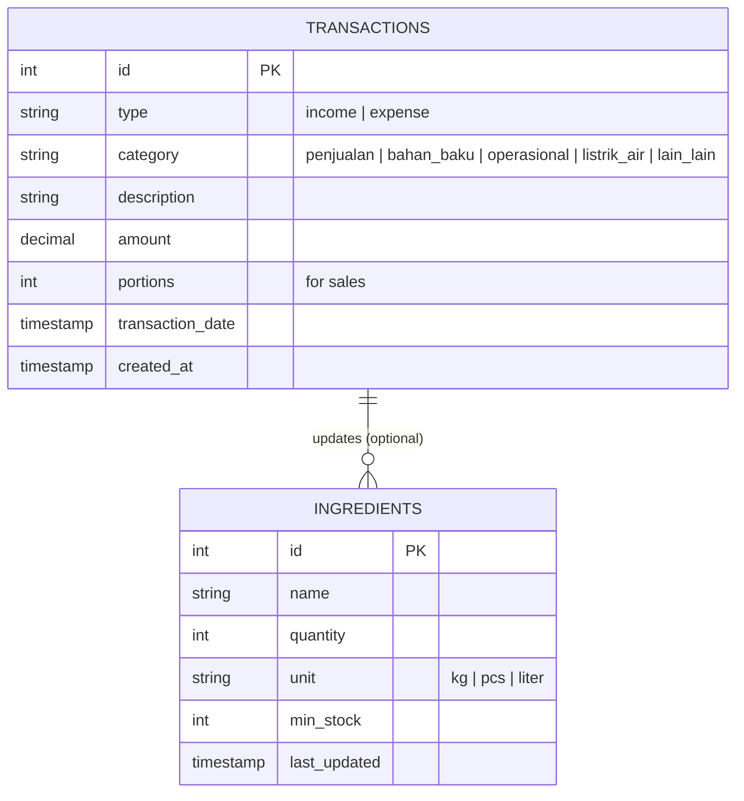

# Tahu Walik Manager - Documentation

## 📋 Daftar Isi
- [Overview](#overview)
- [ERD (Entity Relationship Diagram)](#erd-entity-relationship-diagram)
- [Use Case Scenario](#use-case-scenario)
- [Fitur Aplikasi](#fitur-aplikasi)
- [Struktur Database](#struktur-database)

---

## Overview

**Tahu Walik Manager** adalah aplikasi manajemen keuangan untuk usaha Tahu Walik yang membantu mencatat dan menganalisis:
- Penjualan (income)
- Pengeluaran (expense)
- Stok bahan baku
- Laporan keuangan

**Tech Stack:**
- Framework: Next.js 16.1.6 (Turbopack)
- Language: TypeScript
- Database: PostgreSQL
- ORM: Drizzle ORM
- Styling: Tailwind CSS v4

---

## ERD (Entity Relationship Diagram)

### Diagram



### Tabel Database

#### 1. `transactions`
Tabel untuk menyimpan semua transaksi keuangan (pemasukan dan pengeluaran).

| Column | Type | Constraint | Description |
|--------|------|------------|-------------|
| `id` | integer | PRIMARY KEY, AUTO INCREMENT | ID transaksi |
| `type` | enum | NOT NULL | Tipe transaksi: `income` (pemasukan) atau `expense` (pengeluaran) |
| `category` | enum | NOT NULL | Kategori: `penjualan`, `bahan_baku`, `operasional`, `listrik_air`, `lain_lain` |
| `description` | text | NOT NULL | Deskripsi/keterangan transaksi |
| `amount` | decimal(12,0) | NOT NULL | Jumlah uang (tanpa desimal untuk rupiah) |
| `portions` | integer | DEFAULT 0 | Jumlah porsi terjual (khusus penjualan) |
| `transaction_date` | timestamp | NOT NULL | Tanggal dan waktu transaksi |
| `created_at` | timestamp | DEFAULT NOW() | Waktu pembuatan record |

**Enum Values:**
- `transaction_type`: `['income', 'expense']`
- `category`: `['penjualan', 'bahan_baku', 'operasional', 'listrik_air', 'lain_lain']`

#### 2. `ingredients`
Tabel untuk mengelola stok bahan baku.

| Column | Type | Constraint | Description |
|--------|------|------------|-------------|
| `id` | integer | PRIMARY KEY, AUTO INCREMENT | ID bahan |
| `name` | text | NOT NULL | Nama bahan (ayam, tahu, tepung, dll) |
| `quantity` | integer | NOT NULL, DEFAULT 0 | Jumlah stok (dalam gram/pcs) |
| `unit` | text | NOT NULL | Satuan: `kg`, `pcs`, `liter` |
| `min_stock` | integer | NOT NULL, DEFAULT 0 | Stok minimum untuk alert |
| `last_updated` | timestamp | DEFAULT NOW() | Waktu terakhir update stok |

### Relasi

- **Transactions → Ingredients**: Ketika ada pengeluaran untuk bahan baku, stok ingredients dapat diupdate (opsional, dapat dikembangkan di masa depan)

---

## Use Case Scenario

### Actor

| Actor | Description |
|-------|-------------|
| **Admin/Pemilik** | Pengguna yang mengelola semua aspek aplikasi (transaksi, laporan, settings) |

---

### Use Case 1: Dashboard

**UC-001: Melihat Ringkasan Hari Ini**

| Field | Description |
|-------|-------------|
| **Actor** | Admin |
| **Precondition** | Admin sudah membuka aplikasi |
| **Main Flow** | 1. Admin membuka halaman Dashboard<br>2. Sistem menampilkan Total Untung Hari Ini<br>3. Sistem menampilkan statistik: Omzet, Pengeluaran, Porsi Terjual, Untung Bersih<br>4. Sistem menampilkan Aktivitas Terbaru |
| **Postcondition** | Admin dapat melihat ringkasan keuangan hari ini |
| **Alternative Flow** | Jika belum ada transaksi, sistem menampilkan empty state dengan tombol "Tambah Transaksi" |

---

### Use Case 2: Kelola Penjualan

**UC-002: Menambah Penjualan**

| Field | Description |
|-------|-------------|
| **Actor** | Admin |
| **Precondition** | Admin berada di halaman Tambah Transaksi |
| **Main Flow** | 1. Admin memilih tipe "Pemasukan"<br>2. Admin memilih kategori "Penjualan"<br>3. Admin memasukkan jumlah uang<br>4. Admin memasukkan jumlah porsi<br>5. Admin memasukkan tanggal dan waktu<br>6. Admin menambahkan keterangan (opsional)<br>7. Admin klik "Simpan Transaksi"<br>8. Sistem menyimpan transaksi ke database<br>9. Sistem redirect ke halaman Penjualan |
| **Postcondition** | Transaksi penjualan tersimpan di database |
| **Alternative Flow** | Jika validasi gagal, sistem menampilkan pesan error |

**UC-003: Melihat Riwayat Penjualan**

| Field | Description |
|-------|-------------|
| **Actor** | Admin |
| **Precondition** | Admin membuka halaman Penjualan |
| **Main Flow** | 1. Sistem menampilkan daftar semua penjualan<br>2. Sistem menampilkan total omzet dan total porsi terjual<br>3. Admin dapat mencari penjualan<br>4. Admin dapat filter berdasarkan tanggal<br>5. Admin dapat edit/hapus penjualan |
| **Postcondition** | Admin dapat melihat dan mengelola riwayat penjualan |

**UC-004: Edit/Hapus Penjualan**

| Field | Description |
|-------|-------------|
| **Actor** | Admin |
| **Precondition** | Admin berada di halaman Penjualan |
| **Main Flow** | 1. Admin klik icon Edit pada penjualan<br>2. Admin ubah jumlah atau porsi<br>3. Admin klik Simpan<br>4. Sistem update data<br><br>Atau:<br>1. Admin klik icon Hapus<br>2. Admin konfirmasi<br>3. Sistem hapus transaksi |
| **Postcondition** | Data penjualan terupdate atau terhapus |

---

### Use Case 3: Kelola Pengeluaran

**UC-005: Menambah Pengeluaran**

| Field | Description |
|-------|-------------|
| **Actor** | Admin |
| **Precondition** | Admin berada di halaman Tambah Transaksi |
| **Main Flow** | 1. Admin memilih tipe "Pengeluaran"<br>2. Admin memilih kategori (Bahan Baku/Operasional/Listrik & Air/Lain-lain)<br>3. Admin memasukkan jumlah uang<br>4. Admin memasukkan tanggal dan waktu<br>5. Admin menambahkan keterangan<br>6. Admin klik "Simpan Transaksi"<br>7. Sistem menyimpan transaksi |
| **Postcondition** | Transaksi pengeluaran tersimpan di database |

**UC-006: Melihat Riwayat Pengeluaran**

| Field | Description |
|-------|-------------|
| **Actor** | Admin |
| **Precondition** | Admin membuka halaman Pengeluaran |
| **Main Flow** | 1. Sistem menampilkan daftar semua pengeluaran<br>2. Sistem menampilkan total pengeluaran<br>3. Admin dapat mencari pengeluaran<br>4. Admin dapat filter berdasarkan tanggal<br>5. Admin dapat edit/hapus pengeluaran |
| **Postcondition** | Admin dapat melihat dan mengelola riwayat pengeluaran |

---

### Use Case 4: Laporan Keuangan

**UC-007: Melihat Laporan Mingguan**

| Field | Description |
|-------|-------------|
| **Actor** | Admin |
| **Precondition** | Admin membuka halaman Laporan |
| **Main Flow** | 1. Sistem menampilkan ringkasan periode yang dipilih<br>2. Sistem menampilkan grafik mingguan (Senin-Minggu)<br>3. Sistem menampilkan statistik: Rata-rata Harian, Total Transaksi<br>4. Admin dapat memilih periode (Hari Ini/7 Hari/30 Hari)<br>5. Admin dapat memilih tipe grafik (Pendapatan/Keuntungan) |
| **Postcondition** | Admin dapat melihat analisis keuangan |
| **Alternative Flow** | Jika belum ada transaksi, sistem menampilkan empty state |

**UC-008: Export Laporan ke PDF**

| Field | Description |
|-------|-------------|
| **Actor** | Admin |
| **Precondition** | Admin berada di halaman Laporan dan ada data transaksi |
| **Main Flow** | 1. Admin klik tombol "Export PDF"<br>2. Sistem generate PDF dengan:<br>&nbsp;&nbsp;&nbsp;- Ringkasan keuangan<br>&nbsp;&nbsp;&nbsp;- Grafik mingguan<br>&nbsp;&nbsp;&nbsp;- Daftar transaksi<br>3. Sistem download file PDF |
| **Postcondition** | Laporan tersimpan sebagai file PDF |

---

### Use Case 5: Aktivitas

**UC-009: Melihat Semua Aktivitas**

| Field | Description |
|-------|-------------|
| **Actor** | Admin |
| **Precondition** | Admin membuka halaman Aktivitas |
| **Main Flow** | 1. Sistem menampilkan semua transaksi (income & expense)<br>2. Sistem menampilkan summary: Total Pemasukan & Pengeluaran<br>3. Admin dapat mencari transaksi<br>4. Admin dapat filter berdasarkan tipe<br>5. Admin dapat filter berdasarkan tanggal<br>6. Sistem menampilkan pagination |
| **Postcondition** | Admin dapat melihat riwayat semua transaksi |

---

### Use Case 6: Notifikasi

**UC-010: Melihat Notifikasi**

| Field | Description |
|-------|-------------|
| **Actor** | Admin |
| **Precondition** | Admin membuka halaman Notifikasi |
| **Main Flow** | 1. Sistem menampilkan notifikasi dari transaksi terbaru<br>2. Notifikasi menampilkan: judul, pesan, waktu<br>3. Admin dapat filter: Semua/Belum Dibaca<br>4. Notifikasi belum dibaca ditandai dengan titik hijau |
| **Postcondition** | Admin dapat melihat notifikasi transaksi terbaru |

---

### Use Case 7: Pengaturan

**UC-011: Mengelola Pengaturan**

| Field | Description |
|-------|-------------|
| **Actor** | Admin |
| **Precondition** | Admin membuka halaman Pengaturan |
| **Main Flow** | 1. Sistem menampilkan profil pengguna<br>2. Admin dapat toggle Mode Gelap<br>3. Admin dapat mengakses:<br>&nbsp;&nbsp;&nbsp;- Profil Saya<br>&nbsp;&nbsp;&nbsp;- Informasi Usaha<br>&nbsp;&nbsp;&nbsp;- Notifikasi<br>&nbsp;&nbsp;&nbsp;- Tampilan<br>&nbsp;&nbsp;&nbsp;- Backup/Restore Data<br>&nbsp;&nbsp;&nbsp;- Bantuan |
| **Postcondition** | Admin dapat mengelola preferensi aplikasi |

---

## Fitur Aplikasi

### 1. Dashboard (`/`)
- Total Untung Hari Ini (highlight)
- Statistik: Omzet, Pengeluaran, Porsi Terjual, Untung Bersih
- Aktivitas Terbaru (max 10)
- Quick access ke tambah transaksi

### 2. Penjualan (`/sales`)
- List semua transaksi penjualan
- Total omzet dan porsi terjual
- Search dan filter
- Edit/hapus transaksi
- Floating add button (mobile)

### 3. Pengeluaran (`/expenses`)
- List semua transaksi pengeluaran
- Total pengeluaran
- Kategori: Bahan Baku, Operasional, Listrik & Air, Lain-lain
- Search dan filter
- Edit/hapus transaksi

### 4. Tambah Transaksi (`/add`)
- Toggle Pemasukan/Pengeluaran
- Input: jumlah uang, kategori, porsi (untuk penjualan), tanggal, waktu, keterangan
- Validasi form
- Auto redirect setelah simpan

### 5. Laporan (`/reports`)
- Ringkasan periode (Hari Ini/7 Hari/30 Hari)
- Grafik mingguan (Senin-Minggu)
- Toggle grafik: Pendapatan/Keuntungan
- Rata-rata harian & total transaksi
- Export ke PDF

### 6. Aktivitas (`/activity`)
- Semua transaksi (income & expense)
- Summary pemasukan & pengeluaran
- Search, filter tipe, filter tanggal
- Pagination (5 items per page)

### 7. Notifikasi (`/notifications`)
- Notifikasi dari transaksi terbaru
- Filter: Semua/Belum Dibaca
- Indikator belum dibaca
- Mark as read & delete

### 8. Pengaturan (`/settings`)
- Profil pengguna
- Toggle Dark Mode
- Menu: Profil, Informasi Usaha, Notifikasi, Tampilan, Bahasa, Backup/Restore, Bantuan
- Logout

---

## Struktur Database

### Schema Location
`db/schema.ts`

### SQL Representation

```sql
-- Enum types
CREATE TYPE transaction_type AS ENUM ('income', 'expense');
CREATE TYPE category AS ENUM ('penjualan', 'bahan_baku', 'operasional', 'listrik_air', 'lain_lain');

-- Table: transactions
CREATE TABLE transactions (
    id INTEGER PRIMARY KEY GENERATED ALWAYS AS IDENTITY,
    type transaction_type NOT NULL,
    category category NOT NULL,
    description TEXT NOT NULL,
    amount DECIMAL(12, 0) NOT NULL,
    portions INTEGER DEFAULT 0,
    transaction_date TIMESTAMP WITH TIME ZONE NOT NULL,
    created_at TIMESTAMP WITH TIME ZONE DEFAULT NOW() NOT NULL
);

-- Table: ingredients
CREATE TABLE ingredients (
    id INTEGER PRIMARY KEY GENERATED ALWAYS AS IDENTITY,
    name TEXT NOT NULL,
    quantity INTEGER NOT NULL DEFAULT 0,
    unit TEXT NOT NULL,
    min_stock INTEGER NOT NULL DEFAULT 0,
    last_updated TIMESTAMP WITH TIME ZONE DEFAULT NOW() NOT NULL
);
```

---

## File Structure

```
tahu-walik-manager/
├── app/
│   ├── page.tsx              # Dashboard
│   ├── sales/page.tsx        # Penjualan
│   ├── expenses/page.tsx     # Pengeluaran
│   ├── add/page.tsx          # Tambah Transaksi
│   ├── reports/page.tsx      # Laporan
│   ├── activity/page.tsx     # Aktivitas
│   ├── notifications/page.tsx # Notifikasi
│   ├── settings/page.tsx     # Pengaturan
│   ├── actions.ts            # Server Actions
│   └── layout.tsx            # Root Layout
├── components/
│   ├── Sidebar.tsx           # Sidebar navigation
│   ├── Header.tsx            # Header component
│   ├── BottomNav.tsx         # Mobile bottom navigation
│   ├── StatCard.tsx          # Statistics card
│   └── Pagination.tsx        # Pagination component
├── db/
│   ├── schema.ts             # Database schema (Drizzle)
│   └── index.ts              # Database connection
├── lib/
│   ├── pdfExport.ts          # PDF export functionality
│   └── utils.ts              # Utility functions
└── public/                   # Static assets
```

---

## Future Enhancements

### Planned Features
1. **Inventory Management** - Update stok bahan baku otomatis saat ada penjualan
2. **Low Stock Alerts** - Notifikasi ketika stok bahan baku menipis
3. **Multi-user Support** - Role-based access (Admin, Kasir)
4. **Daily/Monthly Reports** - Laporan periode kustom
5. **Charts & Analytics** - Grafik lebih detail (monthly trend, category breakdown)
6. **Export to Excel** - Selain PDF, export ke CSV/Excel
7. **Backup & Restore** - Backup database otomatis
8. **Print Receipt** - Cetak struk penjualan

### Database Improvements
1. Add index on `transaction_date` for better query performance
2. Add foreign key relation between transactions and ingredients
3. Add soft delete for transactions
4. Add audit log for data changes

---

## Version History

| Version | Date | Changes |
|---------|------|---------|
| 1.0.0 | 2026-02-25 | Initial release with core features |

---

**Last Updated:** 2026-02-25  
**Maintained by:** Tahu Walik Development Team
