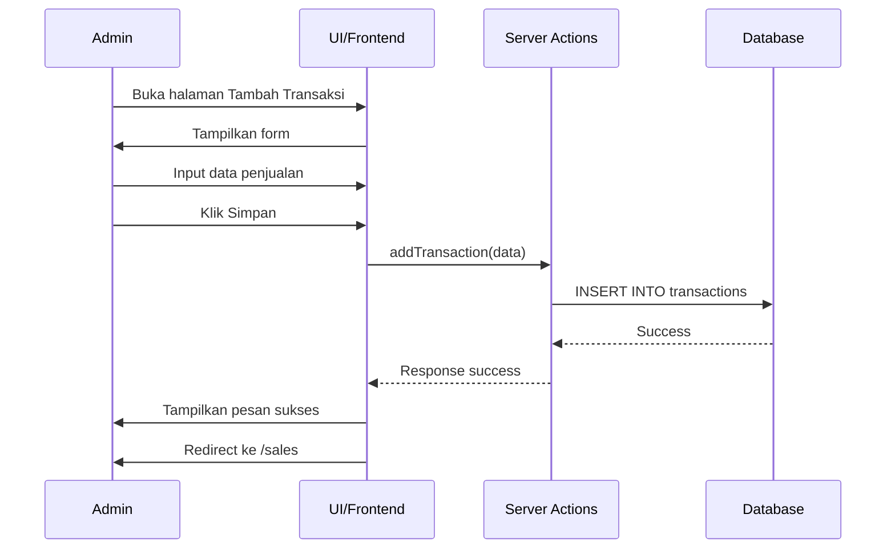
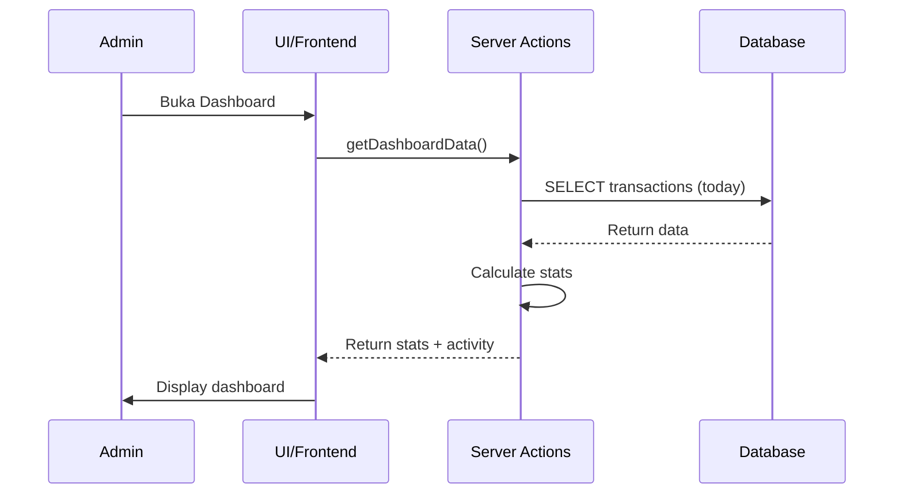

# Tahu Walik Manager - Use Case Scenario (UCS)

## Use Case Diagram

```mermaid
usecaseDiagram
    actor Admin

    package "Tahu Walik Manager" {
        usecase "Dashboard" as UC1
        usecase "Kelola Penjualan" as UC2
        usecase "Kelola Pengeluaran" as UC3
        usecase "Laporan Keuangan" as UC4
        usecase "Aktivitas" as UC5
        usecase "Notifikasi" as UC6
        usecase "Pengaturan" as UC7
        
        usecase "Tambah Transaksi" as UC2_1
        usecase "Edit Transaksi" as UC2_2
        usecase "Hapus Transaksi" as UC2_3
        usecase "Search & Filter" as UC2_4
        
        usecase "Tambah Pengeluaran" as UC3_1
        usecase "Export PDF" as UC4_1
    }

    Admin --> UC1
    Admin --> UC2
    Admin --> UC3
    Admin --> UC4
    Admin --> UC5
    Admin --> UC6
    Admin --> UC7
    
    UC2 ..> UC2_1 : include
    UC2 ..> UC2_2 : include
    UC2 ..> UC2_3 : include
    UC2 ..> UC2_4 : include
    
    UC3 ..> UC3_1 : include
    UC4 ..> UC4_1 : include
```

---

## Detailed Use Case Scenarios

### UC-001: Dashboard

**Nama Use Case:** Dashboard  
**Kode:** UC-001  
**Actor:** Admin  
**Tujuan:** Menampilkan ringkasan keuangan dan aktivitas hari ini

#### Scenario

| Step | Actor Action | System Response |
|------|--------------|-----------------|
| 1 | Admin membuka aplikasi | Sistem menampilkan halaman Dashboard |
| 2 | - | Sistem menampilkan "Total Untung Hari Ini" dengan highlight |
| 3 | - | Sistem menghitung dan menampilkan statistik:<br>- Omzet<br>- Pengeluaran<br>- Porsi Terjual<br>- Untung Bersih |
| 4 | - | Sistem menampilkan "Aktivitas Terbaru" (max 10 transaksi) |
| 5 | Admin klik "Lihat Semua" pada Aktivitas Terbaru | Sistem redirect ke halaman Aktivitas |

#### Business Rules
- Untung = Omzet - Pengeluaran
- Data yang ditampilkan adalah data hari ini (00:00 - 23:59 WIB)
- Jika belum ada transaksi, tampilkan empty state

#### Exception Handling
- **E1:** Jika database tidak tersedia → Tampilkan empty state dengan pesan "Belum ada data"
- **E2:** Jika error saat load data → Tampilkan pesan error dan retry button

---

### UC-002: Kelola Penjualan

**Nama Use Case:** Kelola Penjualan  
**Kode:** UC-002  
**Actor:** Admin  
**Tujuan:** Melihat, menambah, edit, dan hapus transaksi penjualan

#### Main Scenario: Melihat Riwayat Penjualan

| Step | Actor Action | System Response |
|------|--------------|-----------------|
| 1 | Admin membuka halaman Penjualan | Sistem menampilkan daftar semua penjualan |
| 2 | - | Sistem menampilkan summary:<br>- Total Omzet<br>- Total Porsi Terjual |
| 3 | - | Sistem menampilkan search bar dan filter |
| 4 | Admin memasukkan keyword pencarian | Sistem filter transaksi berdasarkan deskripsi |
| 5 | Admin klik filter tanggal | Sistem filter berdasarkan periode yang dipilih |

#### Sub Use Case: Menambah Penjualan (UC-002.1)

| Step | Actor Action | System Response |
|------|--------------|-----------------|
| 1 | Admin klik tombol "+" atau "Tambah Penjualan" | Sistem redirect ke halaman Tambah Transaksi dengan tipe "Pemasukan" |
| 2 | Admin memilih kategori "Penjualan" | Sistem menampilkan form input |
| 3 | Admin memasukkan jumlah uang | - |
| 4 | Admin memasukkan jumlah porsi | - |
| 5 | Admin memilih tanggal dan waktu | - |
| 6 | Admin menambahkan keterangan (opsional) | - |
| 7 | Admin klik "Simpan Transaksi" | Sistem validasi input |
| 8 | - | Jika valid → Simpan ke database dan redirect ke Penjualan<br>Jika tidak valid → Tampilkan pesan error |

**Validasi:**
- Jumlah uang > 0
- Jumlah porsi > 0
- Tanggal tidak boleh di masa depan

#### Sub Use Case: Edit Penjualan (UC-002.2)

| Step | Actor Action | System Response |
|------|--------------|-----------------|
| 1 | Admin klik icon Edit pada transaksi | Sistem menampilkan mode edit dengan input editable |
| 2 | Admin mengubah jumlah atau porsi | - |
| 3 | Admin klik Simpan | Sistem validasi dan update database |
| 4 | - | Tampilkan pesan sukses dan refresh list |

#### Sub Use Case: Hapus Penjualan (UC-002.3)

| Step | Actor Action | System Response |
|------|--------------|-----------------|
| 1 | Admin klik icon Hapus pada transaksi | Sistem menampilkan dialog konfirmasi |
| 2 | Admin klik "Ya" | Sistem hapus transaksi dari database |
| 3 | - | Tampilkan pesan sukses dan refresh list |
| 4 | Admin klik "Batal" | Sistem tutup dialog tanpa menghapus |

---

### UC-003: Kelola Pengeluaran

**Nama Use Case:** Kelola Pengeluaran  
**Kode:** UC-003  
**Actor:** Admin  
**Tujuan:** Melihat, menambah, edit, dan hapus transaksi pengeluaran

#### Main Scenario: Melihat Riwayat Pengeluaran

| Step | Actor Action | System Response |
|------|--------------|-----------------|
| 1 | Admin membuka halaman Pengeluaran | Sistem menampilkan daftar semua pengeluaran |
| 2 | - | Sistem menampilkan summary: Total Pengeluaran |
| 3 | - | Sistem menampilkan search bar dan filter |

#### Sub Use Case: Menambah Pengeluaran (UC-003.1)

| Step | Actor Action | System Response |
|------|--------------|-----------------|
| 1 | Admin klik tombol "+" atau "Tambah Pengeluaran" | Sistem redirect ke halaman Tambah Transaksi dengan tipe "Pengeluaran" |
| 2 | Admin memilih kategori:<br>- Bahan Baku<br>- Operasional<br>- Listrik/Air<br>- Lain-lain | Sistem menampilkan form input |
| 3 | Admin memasukkan jumlah uang | - |
| 4 | Admin memilih tanggal dan waktu | - |
| 5 | Admin menambahkan keterangan | - |
| 6 | Admin klik "Simpan Transaksi" | Sistem validasi dan simpan |

**Kategori Pengeluaran:**
1. **Bahan Baku:** Pembelian bahan produksi (ayam, tahu, tepung, dll)
2. **Operasional:** Biaya operasional harian (gas, kemasan, dll)
3. **Listrik/Air:** Pembayaran listrik dan air
4. **Lain-lain:** Pengeluaran lainnya

---

### UC-004: Laporan Keuangan

**Nama Use Case:** Laporan Keuangan  
**Kode:** UC-004  
**Actor:** Admin  
**Tujuan:** Melihat analisis keuangan dan export laporan

#### Main Scenario: Melihat Laporan

| Step | Actor Action | System Response |
|------|--------------|-----------------|
| 1 | Admin membuka halaman Laporan | Sistem menampilkan ringkasan periode |
| 2 | - | Sistem menampilkan grafik mingguan (Senin-Minggu) |
| 3 | - | Sistem menampilkan statistik:<br>- Rata-rata Harian<br>- Total Transaksi |
| 4 | Admin memilih periode (Hari Ini/7 Hari/30 Hari) | Sistem update ringkasan dan statistik sesuai periode |
| 5 | Admin memilih tipe grafik (Pendapatan/Keuntungan) | Sistem update grafik sesuai tipe |

#### Sub Use Case: Export PDF (UC-004.1)

| Step | Actor Action | System Response |
|------|--------------|-----------------|
| 1 | Admin klik tombol "Export PDF" | Sistem generate PDF dengan:<br>- Ringkasan keuangan<br>- Grafik mingguan<br>- 10 transaksi terbaru |
| 2 | - | Sistem download file PDF ke device admin |

**Business Rules:**
- Grafik menampilkan 7 hari (Senin-Minggu) dari minggu berjalan
- Keuntungan = Pendapatan - Pengeluaran
- Jika keuntungan negatif, tampilkan dengan warna merah (rugi)

---

### UC-005: Aktivitas

**Nama Use Case:** Aktivitas  
**Kode:** UC-005  
**Actor:** Admin  
**Tujuan:** Melihat semua transaksi dengan filter dan pagination

#### Main Scenario

| Step | Actor Action | System Response |
|------|--------------|-----------------|
| 1 | Admin membuka halaman Aktivitas | Sistem menampilkan semua transaksi (income & expense) |
| 2 | - | Sistem menampilkan summary:<br>- Total Pemasukan<br>- Total Pengeluaran |
| 3 | - | Sistem menampilkan search bar |
| 4 | - | Sistem menampilkan filter tipe (Semua/Pemasukan/Pengeluaran) |
| 5 | - | Sistem menampilkan filter tanggal (Hari Ini/Minggu Ini/Bulan Ini/Semua) |
| 6 | Admin memasukkan keyword pencarian | Sistem filter transaksi berdasarkan deskripsi |
| 7 | Admin memilih filter tipe | Sistem filter berdasarkan tipe transaksi |
| 8 | Admin memilih filter tanggal | Sistem filter berdasarkan periode |
| 9 | - | Sistem menampilkan pagination (5 items per page) |

**Business Rules:**
- Transaksi diurutkan dari yang terbaru
- Pagination menampilkan 5 transaksi per halaman
- Filter dapat dikombinasikan (search + tipe + tanggal)

---

### UC-006: Notifikasi

**Nama Use Case:** Notifikasi  
**Kode:** UC-006  
**Actor:** Admin  
**Tujuan:** Melihat notifikasi transaksi terbaru

#### Main Scenario

| Step | Actor Action | System Response |
|------|--------------|-----------------|
| 1 | Admin membuka halaman Notifikasi | Sistem menampilkan notifikasi dari 10 transaksi terbaru |
| 2 | - | Setiap notifikasi menampilkan:<br>- Icon (hijau untuk income, merah untuk expense)<br>- Judul (Penjualan Baru/Pengeluaran Baru)<br>- Pesan (deskripsi + amount)<br>- Waktu & tanggal |
| 3 | - | 3 notifikasi pertama ditandai dengan titik hijau (belum dibaca) |
| 4 | Admin memilih filter "Belum Dibaca" | Sistem tampilkan hanya notifikasi yang belum dibaca |
| 5 | Admin klik icon Check | Sistem tandai notifikasi sebagai sudah dibaca |
| 6 | Admin klik icon Hapus | Sistem hapus notifikasi |

**Business Rules:**
- Notifikasi di-generate otomatis dari tabel transactions
- Belum dibaca = 3 transaksi teratas (berdasarkan ID)
- Icon hijau untuk income, icon merah/orange untuk expense

---

### UC-007: Pengaturan

**Nama Use Case:** Pengaturan  
**Kode:** UC-007  
**Actor:** Admin  
**Tujuan:** Mengelola preferensi aplikasi

#### Main Scenario

| Step | Actor Action | System Response |
|------|--------------|-----------------|
| 1 | Admin membuka halaman Pengaturan | Sistem menampilkan profil pengguna |
| 2 | - | Sistem menampilkan toggle Dark Mode |
| 3 | - | Sistem menampilkan menu groups:<br>- Akun<br>- Preferensi<br>- Data & Penyimpanan<br>- Bantuan |
| 4 | Admin toggle Dark Mode | Sistem ubah tema aplikasi |
| 5 | Admin klik menu (Profil, Informasi Usaha, dll) | Sistem redirect ke halaman detail |

**Menu Pengaturan:**

| Menu | Description | Status |
|------|-------------|--------|
| Profil Saya | Edit profil admin | Future |
| Informasi Usaha | Edit data usaha | Future |
| Notifikasi | Kelola setting notifikasi | Future |
| Tampilan | Setting tema dan display | Partial (Dark Mode) |
| Bahasa | Ganti bahasa aplikasi | Future |
| Backup Data | Export database | Future |
| Restore Data | Import database | Future |
| Pusat Bantuan | FAQ dan panduan | Future |
| Tentang Aplikasi | Info versi aplikasi | ✓ Implemented |

---

## Activity Diagram

### Activity: Tambah Transaksi

```mermaid
activityDiagram
    start
    :Buka halaman Tambah Transaksi;
    :Pilih tipe (Pemasukan/Pengeluaran);
    :Pilih kategori;
    :Input jumlah uang;
    
    if (Tipe = Pemasukan?) then (yes)
        :Input jumlah porsi;
    else (no)
    endif
    
    :Pilih tanggal;
    :Input waktu;
    :Input keterangan (opsional);
    :Klik Simpan;
    
    if (Validasi sukses?) then (yes)
        :Simpan ke database;
        :Tampilkan pesan sukses;
        :Redirect ke halaman terkait;
        stop
    else (no)
        :Tampilkan pesan error;
        stop
    endif
```

### Activity: Lihat Laporan

```mermaid
activityDiagram
    start
    :Buka halaman Laporan;
    :Load data transaksi;
    :Hitung ringkasan periode;
    :Generate grafik mingguan;
    
    if (Ada data?) then (yes)
        :Tampilkan ringkasan;
        :Tampilkan grafik;
        :Tampilkan statistik;
    else (no)
        :Tampilkan empty state;
        stop
    endif
    
    :Admin pilih periode;
    :Update tampilan;
    
    :Admin pilih tipe grafik;
    :Update grafik;
    
    if (Klik Export PDF?) then (yes)
        :Generate PDF;
        :Download PDF;
        stop
    else (no)
        stop
    endif
```

---

## Sequence Diagram

### Sequence: Menambah Penjualan



### Sequence: Load Dashboard



---

## User Flow

### Flow: First Time User

```
1. User buka aplikasi
   ↓
2. Lihat Dashboard (empty state)
   ↓
3. Klik "Tambah Transaksi"
   ↓
4. Input penjualan pertama
   ↓
5. Redirect ke Penjualan
   ↓
6. Lihat transaksi yang baru ditambah
   ↓
7. Kembali ke Dashboard
   ↓
8. Dashboard sudah menampilkan data
```

### Flow: Daily Routine

```
Morning:
1. Buka Dashboard → Lihat statistik hari ini
2. Tambah pengeluaran (beli bahan)
3. Tambah penjualan pertama

Afternoon:
4. Tambah penjualan siang
5. Cek Laporan → Lihat grafik

Evening:
6. Tambah penjualan malam
7. Cek Aktivitas → Lihat semua transaksi hari ini
8. Dashboard update otomatis
```

---

## Error Handling

### Error Scenarios

| Error | Cause | Handling |
|-------|-------|----------|
| Database connection failed | DB down/wrong credentials | Tampilkan empty state + pesan error |
| Invalid input | User input tidak valid | Validasi form + tampilkan pesan error spesifik |
| Transaction failed | DB constraint violation | Rollback + tampilkan pesan error |
| PDF export failed | Library error | Tampilkan pesan error + retry option |

---

## Future Use Cases

### Planned Features

1. **UC-008: Kelola Stok Bahan Baku**
   - Lihat stok ingredients
   - Update stok manual
   - Alert stok menipis

2. **UC-009: Multi-user Support**
   - Login/Logout
   - Role-based access (Admin, Kasir)
   - User management

3. **UC-010: Laporan Kustom**
   - Pilih periode custom
   - Export to Excel
   - Email laporan otomatis

---

**Last Updated:** 2026-02-25  
**Version:** 1.0.0  
**Status:** Active
